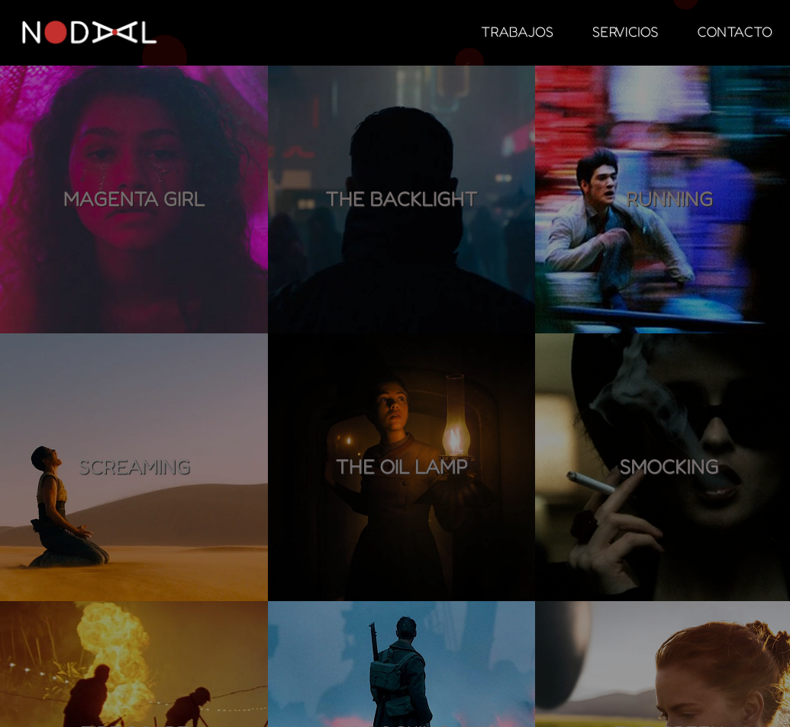
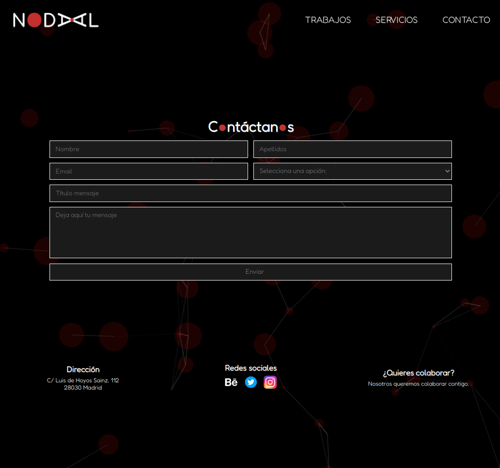

<!-- PROJECT LOGO -->
 

<a href="HTML-url">![HTML][HTML]</a>	
<a href="CSS-url">![CSS][CSS]</a>

  

  <h3 align="center">only_html_css</h3>
  
  

    Un proyecto básico usando HTML y CSS
     
    <a href="https://github.com/angellopezdeleon/only_html_css"><strong>Explora el código »</strong></a>
     
     
    <a href="https://github.com/angellopezdeleon/only_html_css">Mira cómo se ve</a>
    ·
    <a href="https://github.com/angellopezdeleon/only_html_css/issues">Reporta problemas</a>
  

<!-- ABOUT THE PROJECT -->
## Sobre el proyecto

  
   

El proyecto fue realizado dentro del curso de HTML y CSS de la academia Coderhouse.

Se realizó un diseño básico de una página web, que en este caso simula un boceto de web para una productora audiovisual.

<!-- CONTACT -->
## Contacto

Ángel López de León - angel.lopjar@gmail.com - [![LinkedIn][linkedin-shield]][linkedin-url]

Project Link: [https://github.com/angellopezdeleon/only_html_css](https://github.com/angellopezdeleon/only_html_css)

<!-- MARKDOWN LINKS & IMAGES -->
<!-- https://www.markdownguide.org/basic-syntax/#reference-style-links -->
[linkedin-shield]: https://img.shields.io/badge/-LinkedIn-black.svg?style=for-the-badge&logo=linkedin&colorB=555
[linkedin-url]: www.linkedin.com/in/angel-lopez-de-leon-jaramillo
[product-screenshot]: images/nodal1.png
[product-screenshot2]: images/nodal2.png
[HTML]: https://img.shields.io/badge/HTML-orange?style=for-the-badge&logo=html5&logoColor=white
[HTML-url]: https://developer.mozilla.org/es/docs/Web/HTML
[CSS]: https://img.shields.io/badge/CSS-blue?style=for-the-badge&logo=css3&logoColor=white
[CSS-url]: https://developer.mozilla.org/es/docs/Web/CSS
